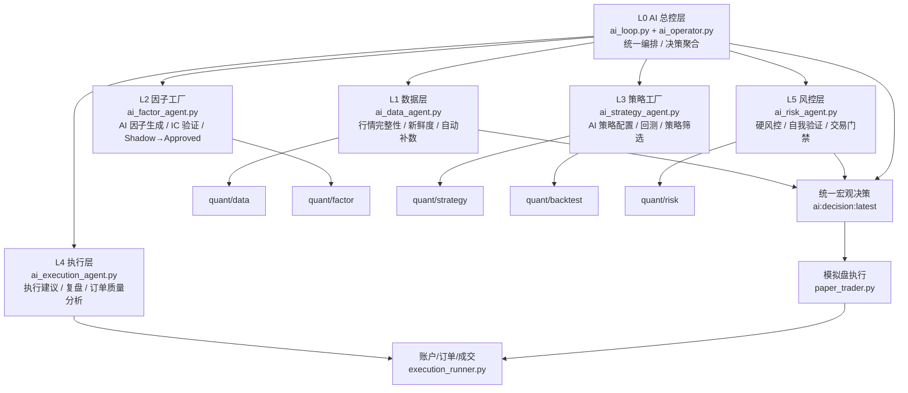
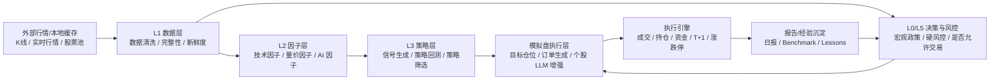
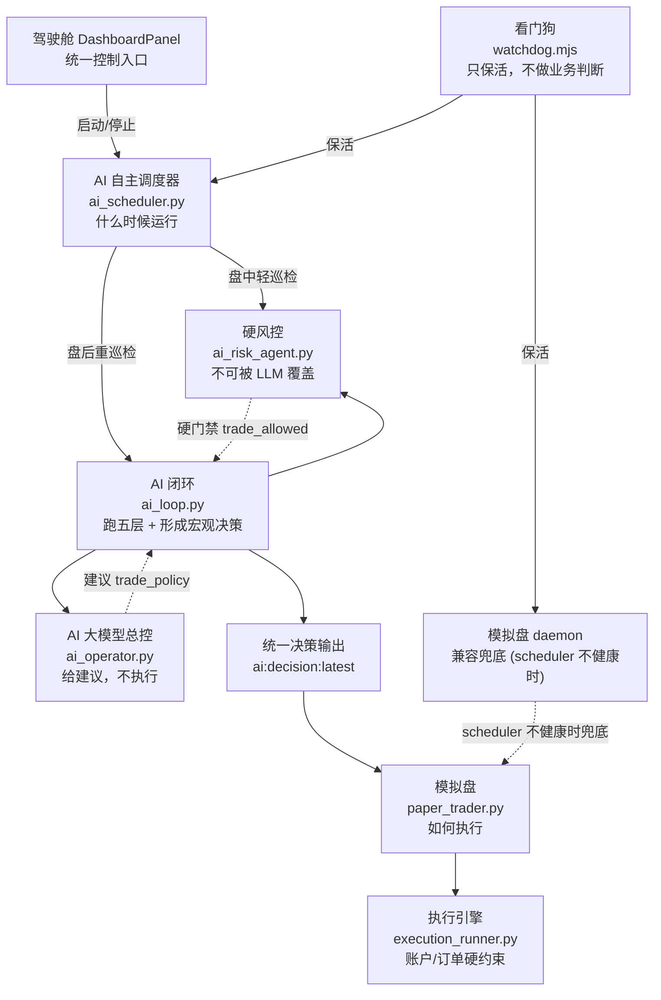
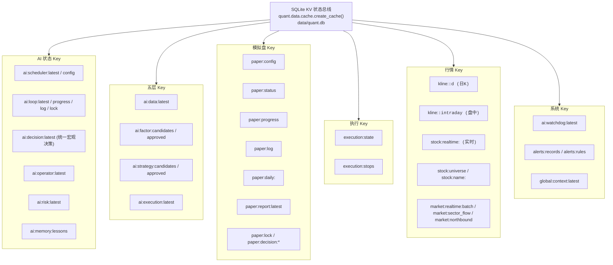
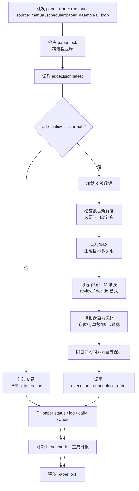
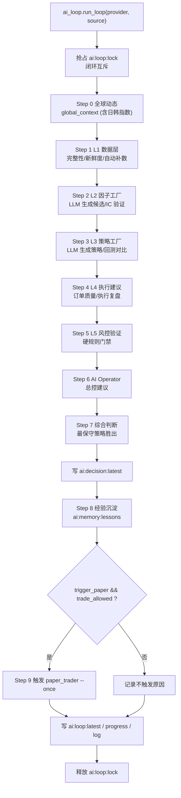

# AlphaCouncil2-AI 系统架构文档

> 本文根据当前项目实际实现整理，描述系统的总体架构、核心工作流程、AI 五层关系，以及自主调度 / AI 决策 / 模拟盘执行之间的职责边界。
>
> 适用版本：AI 自主进化量化系统（含驾驶舱、AI 自主调度器、五层 AI 闭环、模拟盘）。

---

## 目录

1. [总体架构图](#1-总体架构图)
2. [核心工作流程图](#2-核心工作流程图)
3. [AI 五层系统关系图](#3-ai-五层系统关系图)
4. [每层之间的数据依赖关系图](#4-每层之间的数据依赖关系图)
5. [调度 / 决策 / 执行职责关系图](#5-调度--决策--执行职责关系图)
6. [状态总线关系图](#6-状态总线关系图)
7. [模拟盘执行流程图](#7-模拟盘执行流程图)
8. [AI 闭环流程图](#8-ai-闭环流程图)
9. [统一原则](#9-统一原则)

---

## 1. 总体架构图

系统分为四层：前端驾驶舱 / 面板、Node HTTP API、Python AI 量化核心、状态总线（SQLite KV）。

```mermaid
flowchart TB
  %% ───────── Frontend ─────────
  subgraph FE["前端 React / Vite (端口 3333)"]
    App["App.tsx<br/>Tab 导航 + LiveIndexBar"]
    Dashboard["DashboardPanel<br/>AI 自主进化驾驶舱"]
    PaperPanel["PaperPanel<br/>模拟盘配置/日志/日报"]
    ExecutionPanel["ExecutionPanel<br/>交易执行"]
    RiskPanel["RiskPanel<br/>风控监控"]
    AlertPanel["AlertPanel<br/>监控告警"]
    DataPanel["DbPanel<br/>数据/因子/策略/市场浏览"]
  end

  %% ───────── Node API ─────────
  subgraph API["Node HTTP API (端口 3334)"]
    Router["server/router.mjs<br/>统一路由分发"]
    PaperRoute["routes/paper.mjs<br/>Paper + AI 聚合 API"]
    DataRoute["routes/data.mjs"]
    FactorRoute["routes/factor.mjs"]
    StrategyRoute["routes/strategy.mjs"]
    ExecutionRoute["routes/execution.mjs"]
    RiskRoute["routes/risk.mjs"]
    AlertsRoute["routes/alerts.mjs"]
    MarketRoute["routes/market.mjs"]
    SyncRoute["routes/sync.mjs"]
  end

  %% ───────── Process Managers ─────────
  subgraph PM["Node 进程管理层"]
    SchedulerMgr["ai_scheduler_manager.mjs<br/>AI 自主调度器进程管理"]
    PaperMgr["paper_manager.mjs<br/>模拟盘 daemon 管理"]
    Watchdog["watchdog.mjs<br/>进程保活/自愈 (每60s)"]
    PersistentRunner["persistent_runner.mjs<br/>常驻 Python Runner"]
  end

  %% ───────── Python AI Quant ─────────
  subgraph PY["Python AI 量化核心"]
    Scheduler["scripts/ai_scheduler.py<br/>自主调度器 (心跳)"]
    Loop["scripts/ai_loop.py<br/>五层闭环 + 统一宏观决策"]
    Operator["scripts/ai_operator.py<br/>AI 总控建议"]
    DataAgent["scripts/ai_data_agent.py<br/>L1 数据层 AI Agent"]
    FactorAgent["scripts/ai_factor_agent.py<br/>L2 因子工厂"]
    StrategyAgent["scripts/ai_strategy_agent.py<br/>L3 策略工厂"]
    ExecutionAgent["scripts/ai_execution_agent.py<br/>L4 执行建议"]
    RiskAgent["scripts/ai_risk_agent.py<br/>L5 风控验证"]
    GlobalCtx["scripts/global_context.py<br/>全球实时动态"]
    PaperTrader["scripts/paper_trader.py<br/>模拟盘执行器"]
    ExecutionRunner["scripts/execution_runner.py<br/>账户/订单/成交引擎"]
  end

  %% ───────── Quant Core ─────────
  subgraph CORE["quant 核心模块"]
    DataCore["quant/data<br/>行情/缓存/同步"]
    FactorCore["quant/factor<br/>因子计算"]
    StrategyCore["quant/strategy<br/>策略信号"]
    BacktestCore["quant/backtest<br/>事件驱动回测"]
    RiskCore["quant/risk<br/>组合风控"]
  end

  %% ───────── State Bus ─────────
  subgraph STATE["状态总线 / 持久化"]
    Cache["quant.data.cache<br/>SQLite KV (Redis-like)"]
    DB["data/quant.db"]
  end

  %% ───────── External ─────────
  subgraph EXT["外部能力"]
    Market["行情源<br/>Sina / Baostock / Tencent / Eastmoney"]
    LLM["LLM Provider<br/>GLM / DeepSeek / Qwen / Gemini"]
  end

  App --> Dashboard
  App --> PaperPanel
  App --> ExecutionPanel
  App --> RiskPanel
  App --> AlertPanel
  App --> DataPanel

  Dashboard --> PaperRoute
  PaperPanel --> PaperRoute
  ExecutionPanel --> ExecutionRoute
  RiskPanel --> RiskRoute
  AlertPanel --> AlertsRoute
  DataPanel --> DataRoute
  DataPanel --> FactorRoute
  DataPanel --> StrategyRoute
  App --> MarketRoute

  Router --> PaperRoute
  Router --> DataRoute
  Router --> FactorRoute
  Router --> StrategyRoute
  Router --> ExecutionRoute
  Router --> RiskRoute
  Router --> AlertsRoute
  Router --> MarketRoute
  Router --> SyncRoute

  PaperRoute --> SchedulerMgr
  PaperRoute --> PaperMgr
  DataRoute --> PersistentRunner
  FactorRoute --> PersistentRunner
  StrategyRoute --> PersistentRunner
  ExecutionRoute --> PersistentRunner
  RiskRoute --> PersistentRunner
  MarketRoute --> PersistentRunner

  SchedulerMgr --> Scheduler
  PaperMgr --> PaperTrader
  Watchdog --> SchedulerMgr
  Watchdog --> PaperMgr

  Scheduler --> Loop
  Loop --> DataAgent
  Loop --> FactorAgent
  Loop --> StrategyAgent
  Loop --> ExecutionAgent
  Loop --> RiskAgent
  Loop --> Operator
  Loop --> GlobalCtx
  Loop --> PaperTrader

  PaperTrader --> ExecutionRunner

  DataAgent --> DataCore
  FactorAgent --> FactorCore
  StrategyAgent --> StrategyCore
  StrategyAgent --> BacktestCore
  RiskAgent --> RiskCore
  PaperTrader --> StrategyCore
  PaperTrader --> FactorCore

  DataCore --> Cache
  FactorCore --> Cache
  StrategyCore --> Cache
  BacktestCore --> Cache
  ExecutionRunner --> Cache
  RiskCore --> Cache
  Scheduler --> Cache
  Loop --> Cache
  Operator --> Cache
  PaperTrader --> Cache
  GlobalCtx --> Cache
  Watchdog --> Cache
  Cache --> DB

  DataCore --> Market
  GlobalCtx --> Market
  Operator --> LLM
  FactorAgent --> LLM
  StrategyAgent --> LLM
  RiskAgent --> LLM
  PaperTrader --> LLM
```



---

## 2. 核心工作流程图

从用户在驾驶舱点击「启动自主调度」，到 AI 调度器按时段巡检、AI 闭环形成决策、最终模拟盘执行的完整链路。

```mermaid
sequenceDiagram
  participant User as 用户
  participant Dashboard as 驾驶舱
  participant API as /api/paper
  participant SchedulerMgr as ai_scheduler_manager
  participant Scheduler as ai_scheduler.py
  participant Loop as ai_loop.py
  participant Operator as ai_operator.py
  participant Risk as ai_risk_agent.py
  participant Cache as SQLite/KV 状态总线
  participant Paper as paper_trader.py
  participant Exec as execution_runner.py

  User->>Dashboard: 点击「启动自主调度」
  Dashboard->>API: action=ai_scheduler_start
  API->>SchedulerMgr: startDaemon()
  SchedulerMgr->>Scheduler: spawn ai_scheduler.py --daemon
  Scheduler->>Cache: 写 ai:scheduler:config enabled=true
  Scheduler->>Cache: 写 ai:scheduler:latest running=true

  loop 按时段循环
    Scheduler->>Scheduler: determine_mode()

    alt 盘中 intraday (交易日 09:30-15:00)
      Scheduler->>Cache: 采集全球动态
      Scheduler->>Cache: 检查 L1 数据新鲜度
      Scheduler->>Risk: 运行 L5 风控轻巡检
      Risk->>Cache: 写 ai:risk:latest
      Scheduler->>Cache: 写 ai:scheduler:latest

    else 盘后 postclose (交易日 15:00-23:59)
      Scheduler->>Loop: run_loop(trigger_paper=true, source=scheduler)
      Loop->>Cache: 抢占 ai:loop:lock (互斥)
      Loop->>Cache: 采集全球动态
      Loop->>Cache: 运行 L1 数据层 (含自动补数)
      Loop->>Cache: 运行 L2 因子工厂
      Loop->>Cache: 运行 L3 策略工厂
      Loop->>Cache: 运行 L4 执行建议
      Loop->>Risk: 运行 L5 风控验证
      Risk->>Cache: 写 ai:risk:latest
      Loop->>Operator: 生成 AI 总控建议
      Operator->>Cache: 写 ai:operator:latest
      Loop->>Cache: 写 ai:decision:latest (统一宏观决策)

      alt final_trade_allowed=true
        Loop->>Paper: paper_trader.py --once --source scheduler
        Paper->>Cache: 读取 ai:decision:latest
        Paper->>Paper: 策略信号 + 个股 LLM 增强
        Paper->>Paper: 事前风控
        Paper->>Exec: 下单/成交
        Exec->>Cache: 写 execution:state
        Paper->>Cache: 写 paper:status / paper:log / paper:daily
      else final_trade_allowed=false
        Loop->>Cache: 记录跳过交易原因
      end

      Loop->>Cache: 释放 ai:loop:lock

    else 夜间/非交易日 idle
      Scheduler->>Cache: 全球动态 + 数据新鲜度轻巡检
      Scheduler->>Cache: 写 ai:scheduler:latest
    end
  end
```

---

## 3. AI 五层系统关系图

当前项目实际采用的是 **L0 总控 + L1-L5 五层 AI 量化架构**。



### 各层职责说明

| 层 | 模块 | 职责 | 不负责 |
|---|---|---|---|
| **L0 总控** | `ai_loop.py` + `ai_operator.py` | 跑五层闭环、汇总决策、写 `ai:decision:latest` | 不直接下单、不作为主 daemon 调度器 |
| **L1 数据层** | `ai_data_agent.py` | 数据完整性检查、新鲜度判断、自动补数 | 不直接交易 |
| **L2 因子工厂** | `ai_factor_agent.py` | LLM 生成候选因子、安全 DSL 计算、IC/IR 验证、Shadow→Approved | 不直接进生产 |
| **L3 策略工厂** | `ai_strategy_agent.py` | LLM 生成策略配置 JSON、自动回测、与基线对比 | 不直接执行交易 |
| **L4 执行建议** | `ai_execution_agent.py` | 生成执行建议、订单质量分析、执行复盘 | 不直接下单 |
| **L5 风控层** | `ai_risk_agent.py` | 硬风控门禁（数据过期/严重告警则禁交易）、自我验证、经验沉淀 | 不依赖 Operator 结果做阻断（避免循环依赖） |

---

## 4. 每层之间的数据依赖关系图



---

## 5. 调度 / 决策 / 执行职责关系图

这是系统重构后最重要的边界图，明确自主调度、AI 决策、模拟盘执行三者的职责。



### 职责边界表

| 模块 | 负责什么 | 不负责什么 |
|---|---|---|
| `DashboardPanel` 驾驶舱 | 统一观察、启动/停止自主调度、手动触发巡检/闭环 | 不直接下单 |
| `ai_scheduler.py` 自主调度器 | 判断时间段，决定跑轻巡检/重巡检/idle | 不做最终交易决策、不下单 |
| `ai_loop.py` AI 闭环 | 跑五层闭环，生成 `ai:decision:latest` | 不作为主 daemon 调度器 |
| `ai_operator.py` AI 总控 | LLM 总控建议，生成 `trade_policy` | 不下单、不改配置、不执行代码 |
| `ai_risk_agent.py` 硬风控 | 硬风控门禁，数据过期/严重告警则禁止交易 | 不依赖 Operator 结果做阻断 |
| `paper_trader.py` 模拟盘 | 策略信号、个股 LLM 增强、模拟盘下单 | 不做宏观主调度 |
| `execution_runner.py` 执行引擎 | 账户、订单、成交、T+1、涨跌停、费用 | 不做策略决策 |
| `watchdog.mjs` 看门狗 | daemon 保活和告警 | 不做交易判断 |

### 防重复机制

为避免多入口并发触发交易，系统有三层保护：

1. **AI 闭环互斥锁** `ai:loop:lock`：防止 scheduler daemon、手动闭环、CLI 并发跑五层闭环。
2. **模拟盘跨进程锁** `paper:lock`：防止 daemon 与 run_now 并发执行 `run_once`。
3. **同日同股幂等** `paper:decision:<date>:<code>:<direction>`：防止同日同股票同方向重复下单。
4. **模拟盘让位机制**：当 AI 自主调度器启用且健康时，模拟盘 daemon 进入待命模式，不主动触发交易；scheduler 不健康时模拟盘可作为兜底。

---

## 6. 状态总线关系图

项目没有传统事件总线，而是使用 SQLite KV 作为轻量状态总线。所有模块通过统一的 cache key 共享状态。



---

## 7. 模拟盘执行流程图

模拟盘执行器（`paper_trader.py`）的内部执行流程，包含多层风控保护和幂等机制。



---

## 8. AI 闭环流程图

AI 闭环（`ai_loop.py`）是系统的「大脑循环」，跑完整九步并形成统一宏观决策。



### 宏观决策聚合规则（Step 7）

`ai_loop.py` 在 Step 7 采用「最保守策略胜出」原则合并多层判断：

```text
policies = [global_policy, operator_policy]
if not data_ok:      policies.append("no_new_position")
if not risk_ok:      policies.append("no_new_position")

priority = {"normal": 0, "reduce_only": 1, "no_new_position": 2}
final_policy = max(policies, key=priority)   # 最保守胜出
final_trade_allowed = (final_policy == "normal") and data_ok and risk_ok
```

安全边界：

- 全球动态只影响 `trade_policy`，不直接触发买入。
- 硬风控规则不可被 AI 覆盖。
- 所有层失败都降级为保守模式。
- 经验只用于上下文参考，不覆盖硬规则。

---

## 9. 统一原则

整个系统可以概括为一条主线：

```text
驾驶舱统一控制
  → AI Scheduler 统一调度 (什么时候运行)
    → AI Loop 统一编排五层 (跑五层闭环)
      → AI Operator + Risk 给出宏观决策
        → ai:decision:latest 作为唯一决策出口
          → Paper Trader 执行模拟盘 (如何执行)
            → Execution Runner 维护账户和成交
              → Cache/SQLite 作为全局状态总线
```

核心职责原则：

```text
调度归 scheduler      — 决定什么时候运行
决策归 ai_loop         — 跑五层闭环，形成统一宏观决策
建议归 operator        — LLM 总控建议，不执行
硬风控归 risk          — 不可被 LLM 覆盖
执行归 paper_trader    — 模拟盘执行，不做主调度
账户归 execution       — 订单/成交/T+1/涨跌停硬约束
保活归 watchdog        — 进程保活，不做业务判断
观察与控制归 cockpit   — 驾驶舱统一控制与观察入口
```

---

## 相关文件索引

| 层 | 关键文件 |
|---|---|
| 前端 | `App.tsx`, `components/DashboardPanel.tsx`, `components/PaperPanel.tsx`, `components/DbPanel.tsx` |
| Node API | `server/router.mjs`, `server/routes/paper.mjs`, `server/routes/data.mjs`, `server/routes/market.mjs` |
| 进程管理 | `server/ai_scheduler_manager.mjs`, `server/paper_manager.mjs`, `server/watchdog.mjs`, `server/persistent_runner.mjs` |
| AI 调度 | `scripts/ai_scheduler.py`, `scripts/ai_loop.py` |
| AI 五层 | `scripts/ai_data_agent.py`, `scripts/ai_factor_agent.py`, `scripts/ai_strategy_agent.py`, `scripts/ai_execution_agent.py`, `scripts/ai_risk_agent.py` |
| AI 总控 | `scripts/ai_operator.py`, `scripts/global_context.py` |
| 模拟盘 | `scripts/paper_trader.py`, `scripts/execution_runner.py` |
| 数据层 | `quant/data/cache.py`, `quant/data/sync_service.py`, `scripts/market_data.py`, `scripts/data_runner.py` |
| 量化核心 | `quant/factor/`, `quant/strategy/`, `quant/backtest/`, `quant/risk/` |

---

*本文档随系统实现同步更新。如架构有重大调整，请同步修订本文。*
