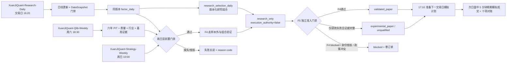
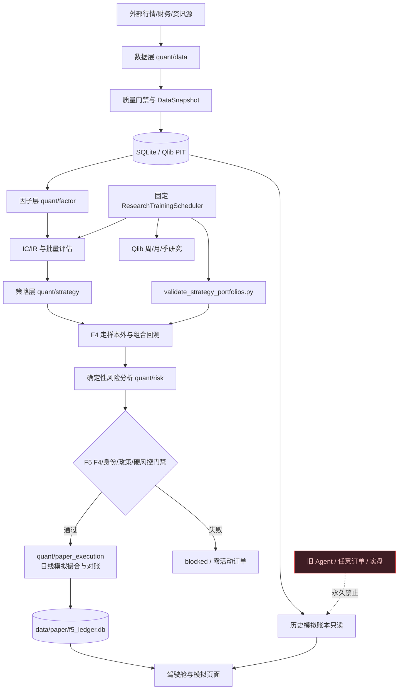
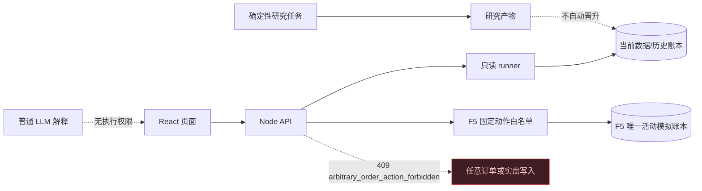
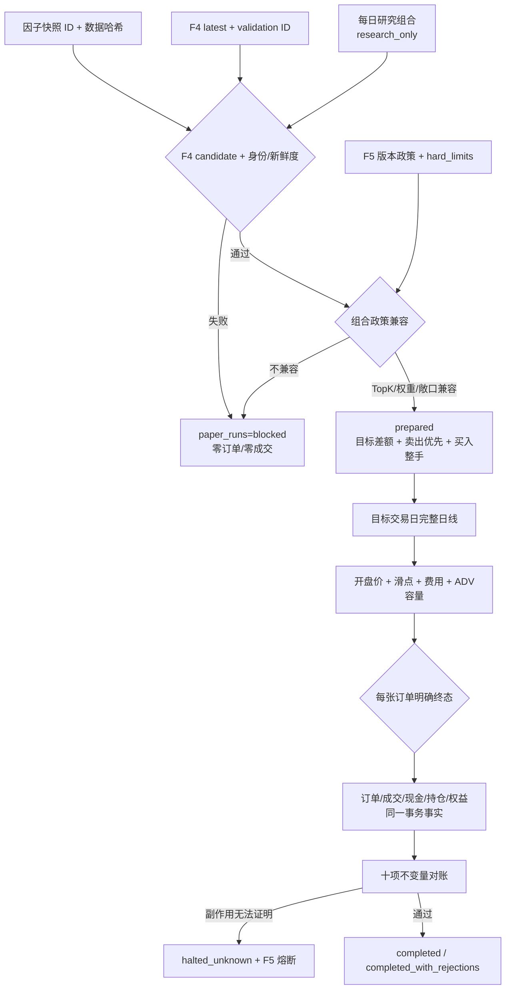
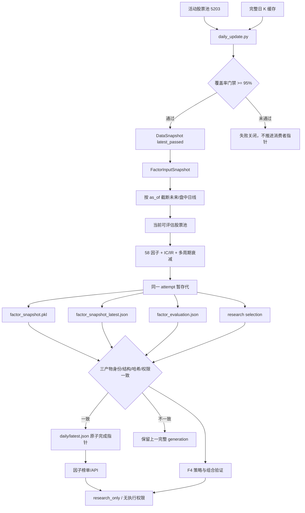
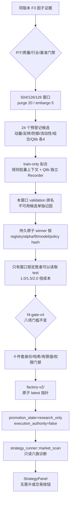
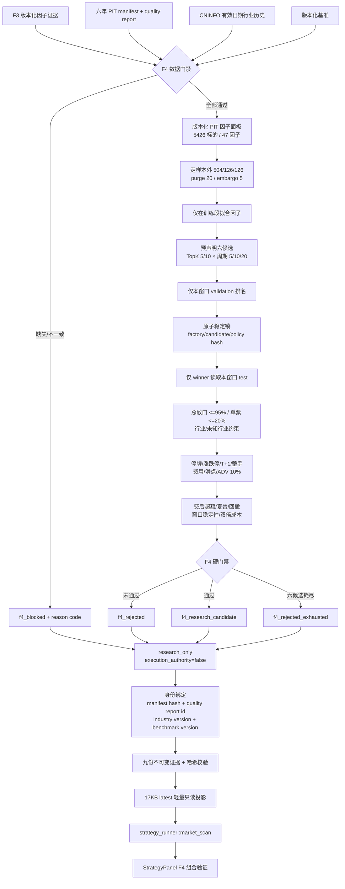
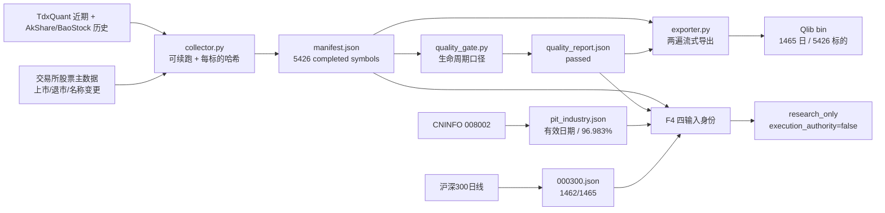

# XuanJiQuant 当前系统工作流图

> 架构规则更新：2026-08-20（Asia/Shanghai）。AI Agent 控制面已退役；历史数据库记录不代表当前能力。运行数据必须以各产物自己的时间字段为准，下方带日期的数值只表示历史快照。

## 确定性研究日程（2026-08-19 规则）

三项研究外部时钟均使用 `IgnoreNew` 和 4 小时上限。每日组合必须绑定当日快照 ID、数据哈希、因子版本、F4 validation ID 与组合政策版本；旧组合不能冒充当前结果。周日 F4 必须看到周五同版本因子和本周六 Qlib 成功账本，任何缺口均失败关闭。独立 F5 日频时钟在周一至周五 17:10 运行，`IgnoreNew`、15 分钟重试最多 3 次、最长 2 小时；盘中时钟在 09:35-11:25、13:05-14:50 每 5 分钟运行。两者只有本地模拟权限，不含 Agent、生产晋升或实盘权限。

页面投影保持双链分离：`market_scan` 显示“F4/PIT 数据截止日”和周频门禁；`research_selection` 显示“当前因子/选股日”和每日组合。两者只在 `StrategyPanel` 并列展示，任一失败不覆盖另一条证据；每日组合固定为 `research_only`、`execution_authority=false`，不构成交易信号。

2026-08-19 09:35 的运行快照：当时预期最新完整交易日为 2026-08-18；日线快照覆盖 5201/5203，58 个因子与数据哈希一致，`research_selection_daily` 生成 20 只股票的诊断研究组合。来源 F4 状态是 `f4_rejected`，所以该组合仅用于诊断研究，不表示 F4 门禁通过，更不表示可以交易。

## 权限图

## 页面到源码

| 页面 | API | Python/领域 | 状态 |
|---|---|---|---|
| 投资驾驶舱 | `/api/workbench` | F5 account/risk/alert/global context 只读聚合 | 可用 |
| 因子研究 | `/api/factor` | `quant/factor`、`evaluate_factors.py` | 可用 |
| F4 组合验证 | `/api/strategy` | `validate_strategy_portfolios.py`、`quant/strategy/f4_*`、`portfolio*` | 等待真实窗口指标/只读研究 |
| F5 模拟执行/组合 | `/api/paper-execution` | `quant/paper_execution`、`f5_paper_runner.py` | 确定性模拟；无实盘权限 |
| 统一模拟账本 | `/api/paper-execution`、`/api/execution` | `f5_paper_runner.py`、`active_account_projection` | F5 唯一活动账户；实盘关闭 |
| 历史执行审计 | 审计回放、`/api/paper` | `quant/data/audit.py`、`paper_runner.py` | 历史只读，不参与当前账户 |
| 风险与审计 | `/api/risk` | `risk_runner.py`、`quant/data/audit.py` | 可用 |
| 市场数据 | `/api/data`、`/api/sync` | data runner/sync service | 可用 |
| 市场资讯 | `/api/jin10`、`/api/cninfo` | 对应 runner | 可用 |
| Agent 页面/API/运行时 | 无 | 已删除 | 退役 |

## F5 确定性模拟执行闭环（2026-08-19 规则）

权限分离：研究组合仍是 `research_only`、`execution_authority=false`；F5 只在独立模拟准入通过后为本地计划生成 `paper_execution_authority=true`，同时固定 `live_execution_authority=false`。UI/API 不能提交代码、方向、数量或价格。F4 为 `f4_rejected` 时策略质量仍是 `unqualified`；若且仅若拒绝原因属于五项纯绩效门槛、数据/身份完整且约束与未来数据违规均为 0，可进入 `experimental_paper`。`f4_blocked` 或任一安全证据异常继续失败关闭。

2026-08-19 16:18 运行证据：`XuanJiQuant-Paper-Daily` 已安装并实际启动返回 0；活动链路止于 `blocked_by_f4`，目标交易日 `20260820`，订单/成交均为 0。页面与 API 同时显示“模拟能力存在、当前模拟许可为否、实盘许可为否”；任意下单在控制面和 F5 白名单形成双层拒绝。固定合格测试覆盖“走样本组合 → 确定性差额订单 → 日线撮合 → T+1/费用/滑点 → 十项对账 → 终态”，只用于证明实现闭环，不改变活动 F4 审计事实。

## 历史与当前的分界

`quant.db` 可能仍含 `agent_runs`、`agent_events`、`agent_tool_calls`、authority/session、旧 `ai:*` KV 和带 `agent_run_id` 的订单字段。它们仅供历史审计与问题回放；当前代码不启动、不读取为控制状态，也不据此恢复交易。

## 因子层当前闭环（2026-08-14）

职责边界：数据层只负责可验证的数据产品；因子层只负责计算和评估；策略层只消费同版本因子；页面只展示；执行写入保持关闭。`ResearchTrainingScheduler` 是确定性时间触发器，不是 AI Agent，也不能修改股票池规则、晋升研究产物或产生订单。

## F4 多 Alpha 候选工厂 v2（活动架构，真实六年结果待重跑）

模块职责：`f4_alpha_contracts.py` 定义 v2 Alpha、候选与注册表身份；`f4_alpha_rules.py` 只负责规则特征、截面处理和训练段拟合；`f4_qlib_adapter.py` 只负责窗口隔离的 Qlib 训练/预测；`f4_candidate_factory.py` 与 `f4_real_pipeline.py` 负责候选隔离、榜单、锁和 winner-only test；`f4_v2_publication.py` 负责 exact-10 发布与读取完整性。v1/v2 下游读取必须显式分支，不能靠字段存在猜版本。

## F4 策略与组合验证闭环（2026-08-19 至 2026-08-20 的 v1 历史候选工厂）

`test` 切片不得用于窗口纳入、候选排名或重选；锁先于 test 持久化，崩溃重跑复用同一锁。研究组合到 F5 必须精确携带并核对 `factory_run_id + candidate_id + lock_hash + policy_hash`；新工厂身份缺失时失败关闭，不回退旧 Top20。以上仍为 `research_only`，不授予真实交易权限。

2026-08-18 11:18 真实快照为 `f4_rejected`，validation ID `65c264ce8f7c6af48e2b6410622c9491dffeb3f1a5509c4e90c23f6db373eeaa`。PIT 面板包含 7,095,568 行、5425 标的和 47 个严格日线因子，6 个完整窗口全部完成；正超额窗口占比 33.33%、聚合费后超额 -80.04%、中位 Sharpe -0.257、最差回撤 -55.61%、双倍成本超额 -90.95%。数据门禁、目标约束和未来数据检查均通过，但 5 项绩效门槛失败，所以不能成为研究候选。F4 无论通过与否都不拥有生产晋升或执行权限；页面不得回退到旧市场扫描、截面代理或历史策略榜单。

2026-08-20 01:54 历史 F4 快照：PIT `daily-pit-2020-08-05-2026-08-19` 的完成清单为 5426 只；目录中的退市残留 `SZ300028.json` 未删除，但不再进入行业、Qlib 或 F4 股票池。validation `5bd6ed52437f6042711ea55854b98cbf1ef83d8596fe35f5c85dcc46d132cc58` 使用 `f4-real-pipeline-v3-nested-candidates-gross-clamp` 和 5 个稳定外层窗口锁；六候选耗尽，费后超额 -74.37%、Sharpe 0.0136、最大回撤 -45.54%、双倍成本超额 -79.11%，状态为 `f4_rejected_exhausted`。v3 修正浮点总敞口尾差并以新身份完整重跑，没有复用 v2 证据。这是策略绩效拒绝，不是数据阻断；后续 F5 实验模拟设计允许该类纯绩效失败进入 `experimental_paper`，但不改变 F4 结论。

### 六年 PIT 数据产品关系

